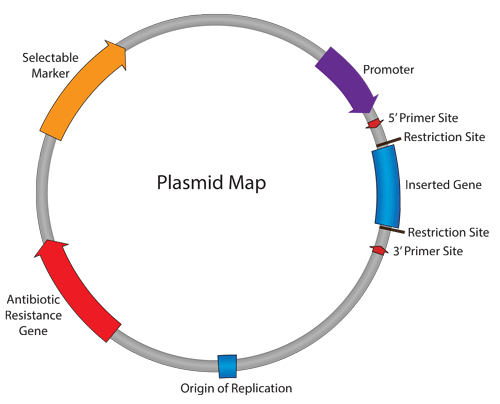

==========
Background
==========

Transformation is the process by which foreign DNA is introduced into a cell. Bacterial cells are commonly used as host cells for making copies of plasmid DNA in the lab because they are quick and easy to grow.

Bacteria, especially *E.coli*, are the workhorse of a molecular lab. They are versatile organisms that can take in DNA and replicate it. 

The bacterial genome is a circular piece of DNA that, unlike eukaryotic DNA, is not contained within a nucleus. Bacteria can also take in small circles of DNA, call plasmids.

********************
What is plasmid DNA?
********************

A plasmid is a double-stranded circular piece of DNA that is separate from the chromosomal DNA of the cell (Figure 1). It replicates independently of the chromosomal DNA.

Plasmids are used in molecular laboratories when studying or manipulating genes, using specifically engineered plasmids, commonly referred to as vectors.

**Figure 1** Basic plasmid map (`Addgene website <http://blog.addgene.org/plasmids-101-what-is-a-plasmid>`_)

There are thousands of different types of plasmids, but a basic structure is illustrated here. Some essential compounds of a plasmid are:

* *Inserted gene* -  a gene of interest, or part of a gene, that is inserted into the plasmid.

* *Origin of replication* - a small, specific sequence where DNA replication begins.

* *Antibiotic resistance gene* - a gene that produces a protein that confers upon the bacteria, resistance to a particular antibiotic.

* *Promoter* - a sequence of DNA that drives the transcription of the inserted gene. The promoter will determine which cell types the gene is expressed in, for example, bacterial, mammalian or yeast.
