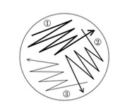

=====
Day 1
=====
********************************************
A. Make Luria broth (LB) and LB agar plates.
********************************************

LB is a nutrient-rich media that is commonly used to grow bacteria. The addition of agar to LB results in the formation of a gel that bacteria can grow on, as they are unable to digest the agar but can gather nutrition from the LB within. You can also add an antibiotic to the broth. The antibiotic allows for the selection of only those bacteria with the specific antibiotic resistance that is conferred by a plasmid carrying the antibiotic resistance gene.

The following protocols require the use of LB and LB agar plates, both with and without antibiotic selection. You will need to make batches of each. They can be stored in airtight containers or wrapped in plastic bags, at 4°C for up to 2 weeks.

1. Weigh out the following reagents each into a 1L Erlenmeyer flask (Table 1). Make a 500 mL batch of LB and a 1L batch of LB; you will add antibiotic to one batch at a later stage (see below).

**Table 1** Reagents for making LB and LB agar plates

.. list-table::
   :widths: 25 25 50
   :header-rows: 1

   * - LB
     - LB agar plates
     - LB agar plates+antibiotic
   * - 5g NaCl
     - 5g NaCl
     - 5g NaCl
   * - 5g tryptone
     - 5g tryptone
     - 5g tryptone
   * - 2.5g yeast extract
     - 2.5g yeast extract
     - 2.5g yeast extract
   * - dH2O to 500mL
     - dH2O to 500mL
     - dH2O to 500mL
   * - 
     - 7.5g agar
     - 7.5g agar
   * - 
     - 
     - ampicillin*

Do not add the antibiotic until after autoclaving and cooling to 55 degrees Celsius.

2. Place magnetic stirrer into the bottom of the flasks and stir to mix.

.. note:: The contents do not have to be completely in solution, but any powder left on the sides of the flask will caramelize on the glass during autoclaving.

3. Cover the top of the flasks with aluminum foil and label with autoclave tape.

4. Autoclave on the liquid setting for 20 minutes or according to your autoclave's specifications.

5. After removing the solution from the autoclave, allow the LB agar solution to cool to 55 degrees Celsius.

.. note:: *This can be done by placing the flask in a 55 degree Celsius oven or water bath because this will hold the temperature and it can be left unattended for some time.*

.. note:: *The LB can cool to room temperature on the bench top.* 

6. Add the appropriate amount of the desired antibiotic to one flask of LB and one flask of LB + agar. The other two flasks (containing LB and LB + agar) will not contain any antibiotic. Table 2 lists commonly used antibiotics. The table specifies what the concentration of the stock solution should be made at.  

**Table 2** Commonly used antibiotics and suggested stock and working concentrations

.. list-table::
   :widths: 25 25 50
   :header-rows: 1

   * - Antibiotic
     - Stock solution concentration*
     - Working solution concentration
   * - Ampicillin
     - 50 mg/mL in H2O
     - 20ug/mL
   * - Carbenicillin
     - 50 mg/mL in H2O 
     - 20ug/mL
   * - Chloramphenicol
     - 34 mg/mL in ethanol
     - 25 ug/mL
   * - Kanamycin
     - 10 mg/mL in H2O
     - 10 ug/mL
   * - Streptomycin
     - 10 mg/mL
     - 10 ug/mL
   * - Tetracycline**
     - 50 mg/mL in ethanol
     - 10 ug/mL

How do I insert the key (the asterisks)

When pouring agar plates, keep your bench area sterile by working near the flame of a Bunsen burner.

7. Label the bottom of each Petri dish with the date and the antibiotic added. If no antibiotic has been added, label each Petri dish with just the date.

.. caution:: *Be sure to pour the LB + agar + antibiotic into the Petri dishes that are labeled with ampicillin, and the LB + agar into the dishes that are labeled with the date only.*

8. Pour approximately 20 mL of LB agar per 10cm polystyrene Petri dish.

.. caution:: *Pour slowly from the flask into the center of the Petri dish. When the agar has spread to cover about two thirds of the dish stop pouring and the agar should spread to cover the entire plate. You may need to tilt the plate slightly to get the agar to spread out completely. If you pour in too much, the plate will be fine, but it will reduce the number of plates you can make per batch.*

.. caution:: *If bubbles are introduced during the pouring, these can be removed by quickly passing the flame of an inverted Bunsen burner over the surface of the plate. Be careful,  if you leave the flame too long it will melt the Petri dish. Also, be careful not to burn yourself.*

9. Place the lids on the plates and allow them to cool for 30-60 minutes (until solidified), then invert the plates. Let the plates sit for several more hours (or overnight). 

****************************************************************
B. Transfer *E.coli* cells from glycerol stock to LB agar plates
****************************************************************

Bacterial stocks are typically stored in a glycerol solution in the -80°C freezer. To isolate a single bacterial colony, you will streak it onto an agar plate in a specific way.

1. Label the bottom of an agar plate with the bacterial strain and the date.

.. caution:: *The LB agar plate should contain no antibiotics because the E.coli do not contain a plasmid that carries an antibiotic resistance gene.*

2. Fill a small tub or dish with dry ice. Remove the vial containing the E.coli from the freezer and place it on the dry ice.
3. Sterilize your inoculation loop by passing it at an angle through the flame of a Bunsen burner until it burns red. 
.. caution:: *Let the loop cool before you scrape your bacterial cells/ inoculum from the vial. If the loop is too hot, it will kill the cells.*
.. caution:: *Do not place the sterilized inoculum loop down on the bench or it will recontaminate it.*
4. Touch the sterile loop to the bacteria in the glycerol stock. Gently scrape a small amount of the inoculum from the vial with your loop. 

**Figure 2** How to streak bacteria onto an agar plate to achieve single colonies

5. Gently spread the bacteria over a section of the plate, as shown in Figure 2, to create streak #1.
6. Using a freshly sterilized loop, drag through streak #1 and spread the bacteria over a second section of the plate, to create streak # 2.
7. Using a freshly sterilized loop, drag through streak #2 and spread the bacteria over the last section of the plate, to create streak # 3.
8. Incubate the plate with the newly streaked bacteria overnight (12-18 hours) at 37°C.

.. only:: End Users

  This paragraph will be shown only in the User's Guide.
  
*Invert the plates, so that if water condensation occurs, the water will collect on the plastic lid, not on the agar.*
