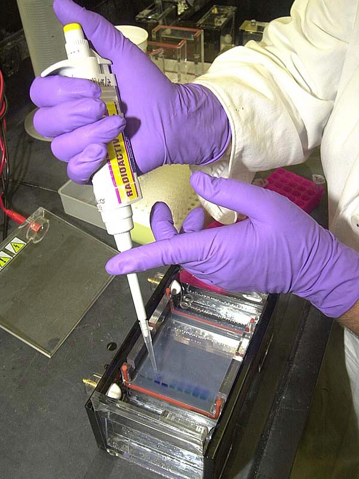
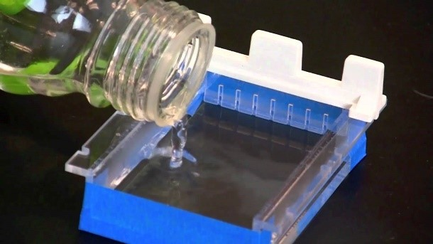
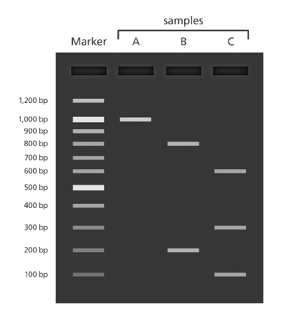

#####
Day 5
#####

===========================================================
F.2 Extract the plasmid DNA using the alkaline lysis method
===========================================================

This is a quick and efficient way to extract plasmid DNA without using a costly commercially available kit.

#. Make the following solutions:

   **Table 3** Recipes for plasmid DNA extraction solutions

   .. list-table::
      :widths: 15 25 25 25 25 
      :header-rows: 1

      * - LB
        - Resuspension solution (P1 buffer)
        - Lysis solution (P2 buffer)
        - Neutralizing solution (P3 buffer)
        - TE
      * - (see Table 1)
        - 50 mM glucose
        - 0.2 NaOH
        - 3 M KOAc (pH 6.0)
        - 1 mM EDTA
      * - 
        - 10 mM EDTA
        - 1% SDS
        - 60 mL 5 M potassium acetate
        - 10 mM Tris-HCl (pH 8.0)
      * - 
        - 25 mM Tris (pH 8.0)
        -
        - 11.5 mL glacial acetate
        -
      * -
        -
        - 
        - 28.5 mL H2O
        -

#. Transfer the overnight bacterial culture to 1.5 mL microfuge tube and spin down the cell culture twice in a table top microcentrifuge at a 12, 000 x g.

#. Discard the supernatant. To remove the liquid completely turn the microfuge tube upside onto a piece of paper towel for a few seconds.

#. Add 100 µL of P1 buffer to each tube and vortex to completely resuspend the cell pellet.

#. Add 100 µL of P2 buffer and mix by gently inverting the tube 5 -6 times. The solution should quickly turn transparent and become more viscous. 

   *This indicates that bacterial lysis has taken place.*
#. Add 150 µL of P3 buffer and mix by inverting the tube several times. 

   *At this point, bacterial chromosomal DNA is usually seen as a white precipitate.*

#. Centrifuge the microfuge tubes at 12, 000 x g for 10 minutes.

#. Carefully transfer the supernatant to a new labeled 1.5 mL microfuge tube. 
   
   *Try not to disturb the white precipitate.*

#. Add 2.5 volume of cold ethanol (stored at -20°C) and mix by inverting the tube several times.

#. Spin down the plasmid DNA precipitate (transparent pellet) at 12, 00 x g in a microcentrifuge for 10 minutes.

#. Discard the supernatant and remove the remaining liquid as much as possible by leaving the tube upside down on a piece of paper towel. Keep the tubes in a tube holder with the lid open for 10-20 minutes so that they can air dry. 

   *To dry faster, put the tubes in a 37°C heating block with the lid open. 
   The DNA precipitate turns white when it is dry.*

#. Resuspend the DNA pellet in 50 µL of TE buffer. Completely dissolve the pellet by pipetting the solution up and down several times.

===============================================================
F.3 Visualize the plasmid DNA using agarose gel electrophoresis
===============================================================

Agarose gel electrophoresis is a standard molecular technique used to separate DNA of varying sizes. 

You can visualize the plasmid DNA as 'bands' in the gel, determine the size of the DNA fragments, purify the bands, and subsequently use the DNA for the cloning or sequencing of genes.

This document explains how to prepare a gel, load and run your experimental samples, and visualize the DNA fragments under ultraviolet light. You can perform this technique in a standard molecular biology laboratory. 

""""""""""""""
You will need:
""""""""""""""
- Agarose powder, reagent grade
- Laboratory scales
- 1XTAE buffer 

  *To make TAE buffer, prepare a 50X stock solution by mixing 242g Tris base, 57.1mL glacial acetic acid, and 100mL of 500mM EDTA (pH 8.0) and bring the volume up to 1L with dH2O. To make a 1XTAE working solution, dilute 50:1 with water.*•	

- Erlenmeyer conical flask
- Microwave oven
- 65°C waterbath
- Ethidium bromide
- Blue laboratory tape
- Eppendorf tubes
- DNA size marker
- Loading dye

  *Make a loading dye at a 6X concentration. It consists of 0.25% bromophenol blue, 0.25% xylene cyanol, and 30% glycerol.*

- Gel electrophoresis tank, tray, combs, electrode and power source

------------------------------
F.3.1 Prepare a 1% agarose gel
------------------------------

Prepare your agarose gel using a weight over volume (w/v) percentage solution. 

#. For a 1% (w/v) agarose gel, weigh out 1gm of agarose into a microwavable flask. Add 100mL of TAE (Tris base, acetic acid, and EDTA) buffer to the flask. 

   **Warning:** *Ensure that the volume of the buffer is less than one third of the capacity of the flask to prevent the mixture from boiling over.*
 
#. Place the flask in a microwave oven and melt the agarose by heating for 30 seconds. While wearing an oven mitt, remove the flask and gently swirl the agarose/ buffer mix.  Repeat this procedure until the agarose is completely dissolved. 

#. Cover and cool the agarose by placing the flask in a 65°C water bath for approximately 1 hour.

#. Add ethidium bromide (EtBr) to a final concentration of 0.5µg/mL. 

   **Warning:** *EtBr is an intercalating fluorescent agent and it is a mutagen. You should always wear a lab coat, eye protection, and gloves when handling EtBr and the EtBr-containing gel.*

#. To prepare the gel tray, place blue laboratory tape across the open ends of the tray and insert the well-casting comb (Figure 6). 

#. Gently pour the agarose into the gel tray (Figure 6). Allow the agarose to set at room temperature for approximately 30-40 minutes. Gently remove the comb and tape. 

   **Caution:** *Pouring the agarose slowly will prevent bubbles forming. Bubbles can disrupt the running of the gel. If bubbles DO form, you can gently push them to the side with a pipette tip.*

**Figure 6:** A typical gel tray used for agarose gel electrophoresis. The blue tape is adhered to either end of the gel tray to prevent leakage of the gel. 

#. Place the gel tray, containing the agarose gel, into the gel box and fill the tank with 1XTAE buffer until the gel is completely covered in buffer.

----------------------------------------
F.3.2	Load the samples and run the gel
----------------------------------------

#. Aliquot the desired concentration of each DNA sample into separate Eppendorf tubes. 
#. Add loading dye to the samples. 

   *The loading dye serves as a visible marker that helps when loading the gel, and it also allows you to gauge how far the DNA has run while you are running your gel. Additionally, the glycerol is heavier than water, so your sample settles in the well rather than diffusing in the buffer.*

#. Using a pipette, slowly and carefully load a DNA size marker into the first well. Next, add each of your experimental samples to the adjacent wells (Figure 7). 

   *To steady your hand as you load the samples, you can rest your hand that is holding the pipette on the gel box, or on your other hand. This will prevent your hand from shaking.* 

**Figure 7:** Experimental samples and a DNA size marker are loaded into the wells of the agarose gel.

#. Place the lid onto the gel tank and attach the electrodes to the power supply. 

   *The cathode is the negative electrode; it is black and should be at the same end of the tank as the wells that contain the samples. The anode is the positive electrode; it is red and it should be at the opposite end of the tank as the wells that contain the samples.  DNA has an overall negative charge and will therefore travel toward the positive electrode.*

#. Set the voltage on the power supply to 100V and turn on the power (Figure 8). 
   
   *To ensure the power supply and gel box are working, you should be able to see small bubbles in the buffer at the electrodes, which indicates that current is passing through.*

.. image:: runningagel.jpg
  :width: 300

**Figure 8:** Gel, gel tank, and power supply are assembled and your gel is ready to run.

#. Run the gel until the dye is approximately 75% of the way through the gel. This will take approximately 1-1.5 hours.

#. Turn off the power, disconnect the electrodes, remove the lid of the gel tank, and carefully remove your gel and the gel tray. Drain off the excess buffer from the surface of the gel. Place the gel on paper towels to absorb any remaining buffer.

----------------------------------------------------------------
F.3.3	Visualize the DNA fragments under ultraviolet (UV) light
----------------------------------------------------------------

   **Warning:** *You should always wear protective clothing when using UV light, such as a lab coat, gloves and face shield.*

   **Caution:** *If you are subsequently going to excise the DNA band from the gel, minimize the exposure of the gel to the UV light in order to minimize the damage to the DNA contained in the gel.*

#. Remove your gel from the gel tray and expose the gel to ultraviolet light.

   *You can visualize your DNA on any device that has UV light such as a medium wavelength UV transilluminator, or on a Gel Documentation System.*

#. The DNA bands will fluoresce when exposed to UV light (Figure 9). Take a picture of your gel.
#. Properly dispose of your gel according to your institute's regulations.

**Figure 9:** Your gel image will show one lane (far left) with a DNA size marker. The adjacent lanes contain your experimental samples. In this image, you can see that the experimental sample in Lane A contains one DNA fragment, Lane B contains 2 DNA fragments, and Lane 3 contains 3 DNA fragments.

