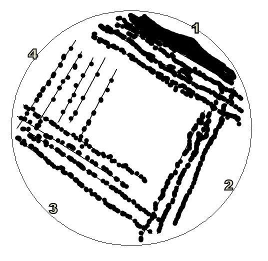

######################
C. Grow *E.coli* cells
######################

*********
**Day 2**
*********

1. Remove your streaked agar plate from the 37°C incubator. You should see bacterial growth on the plate. The growth will be most abundant at streak #1 and it will get progressively scarcer for streak #2 and #3.  There should be single colonies visible on streak #3, see Figure 3.

**Figure 3** Growth of *E.coli* on an LB agar plate following overnight incubation.

2. Working near a Bunsen burner, pour/ pipette 10 mL of sterile LB into a sterile test tube or conical tube.

3. Using a sterile inoculation loop, open the lid of the Petri dish. Touch the loop to a single colony.

4. Place the inoculated loop into the LB and gently swirl the loop in the broth to ensure you inoculate it. Cover the opening of the tube with aluminum foil. This is your 'starter culture'.

5. Incubate the tube at 37°C overnight on a shaking platform.

*********
**Day 3**
*********

6. Remove the tube of starter culture from the shaking platform in the 37°C incubator.

7. Pipette the starter culture into the Erlenmeyer flask of sterile LB that was made on Day 1. Cover the opening of the flask with aluminum foil.

8. Incubate on a shaking platform at 37°C. Measure the optical density periodically (see below).

*************************
*Phases of E.coli growth*
*************************

After the inoculation of the starter culture into the LB, the E.coli cells will grow rapidly at 37°C with shaking. There are various phases of growth, see Figure 4.

.. image:: Schematiccurve.png
  :width: 300
  :alt: Schematiccurve.png

**Figure 4** The 4 phases of E.coli growth following inoculation

- *Lag phase* - the cell density increases slowly. If, for example, you inoculate 1L of LB from a single colony, you will see an extended lag phase. Using this protocol, you inoculate from a 10 mL starter culture so this phase will be relatively short lived.
 
- *Log phase* (also called the exponential phase) - the E.coli cells grow rapidly, or exponentially. The doubling time is approximately 20 minutes. This is the phase where the cells are healthiest and are actively producing proteins. Early- to mid- log phase is the ideal time to harvest the cells. 

- *Stationary phase* - the nutrients in the medium are depleted, metabolic products accumulate, and this stresses the cells and prevents their growth. 

- *Death phase* - excess metabolic products become toxic to the cells. The cells cannot be used to make competent cells and they are not good for protein production.

**************************************************************
**C.1 Measure the optical density (OD) of the *E.coli* cells**
**************************************************************

You will measure the OD600 of the E.coli cells at various time intervals. OD600 is an abbreviation for the absorbance (optical density) of the cells in LB at a wavelength of 600 nm. This is a common method for measuring bacterial (or other) cells in a liquid.

.. image:: spectrophometer.png

**Figure 5** Standard spectrophotometer found in most molecular laboratories

#. Turn on the spectrophotometer.

#. Allow the spectrophotometer to warm up for 15 minutes before calibrating or running any samples.

   **Caution:** *You must recalibrate every time you change the wavelength.*

#. Set the wavelength to 600 nm and make sure the filter lever is at the appropriate position based on the wavelength.

#. To calibrate the spectrophotometer, ensure the sample compartment is empty. Using the 0%T knob (left one) change the data number to 0.00. Make sure the data value is on transmittance, if not, press the mode button until the red light by transmittance lights up.

#. Wearing gloves, get an empty cuvette and fill it to 3/4 with distilled water.

#. Wipe the sides of the cuvette using Kimwipes to ensure that there are no fingerprints.

#. Place the cuvette in a cuvette holder with the arrow facing outwards.

#. Place the cuvette holder in the sample compartment with the arrow facing the wavelength knob.

#. Turn the 100% T/OA knob (right one) until the data value on the screen shows 100.0 transmittance.

#. Remove the cuvette from the sample compartment. Do not turn the knobs anymore.

#. The spectrophotometer is now calibrated. You can now proceed with blanking and reading your sample by inserting solutions into the sample compartment and reading the absorbance.

#. Pipette 2 mL of uninoculated LB into the spectrophotometer cuvette. This is used as a reference blank. Blank the spectrophotometer using LB broth.

#. Every 30 minutes, pipette 2 mL of the growing culture into a clean cuvette and measure. Once the OD600 reaches 0.35-0.4, immediately place the cells on ice.

#. Cool the cell culture for 20-30 minutes. Gently and occasionally, swirl the flask.

**Caution:** *Do not let the OD go higher than 0.4. Check it regularly, particularly when it gets above 0.2 because the cells are growing exponentially at this stage. It usually takes approximately 3 hours to reach an OD of 0.35 if you are using a 10mL starter culture in 1L of LB. It is important that the cells are actively growing when they are harvested because this is when pores are present in the cell wall. The presence of these pores allows the formation of channels through which the DNA molecules can pass.*